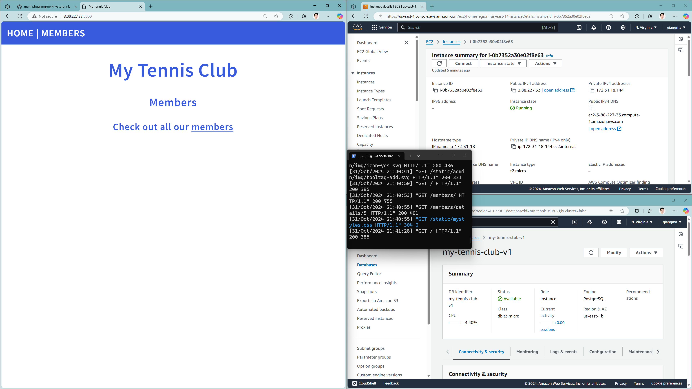
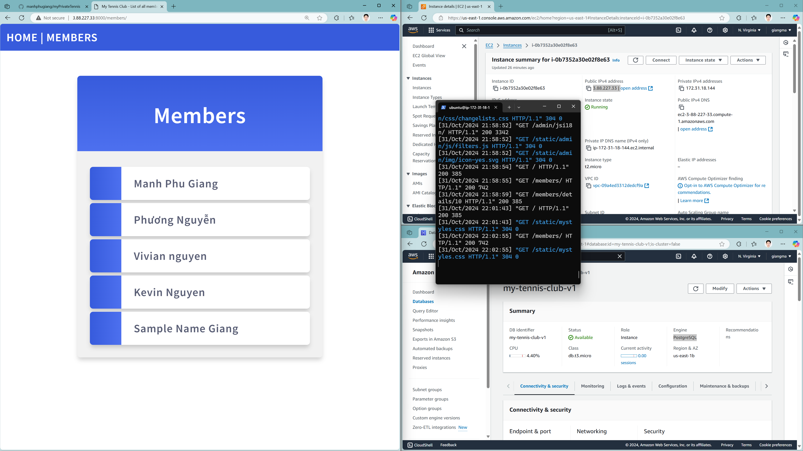
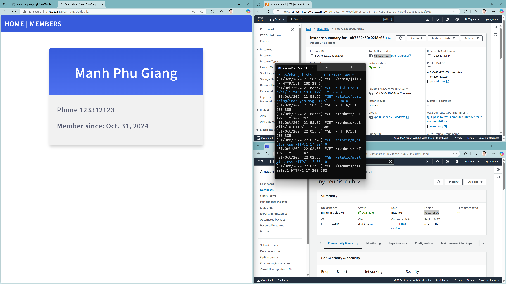
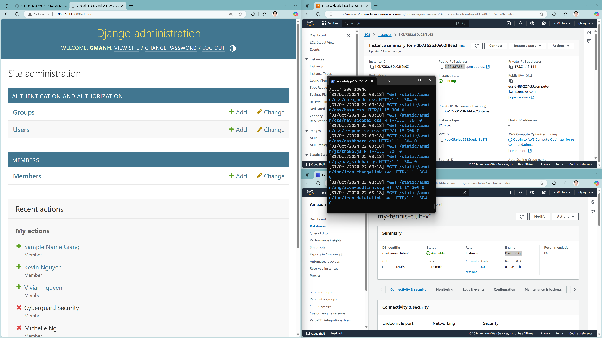
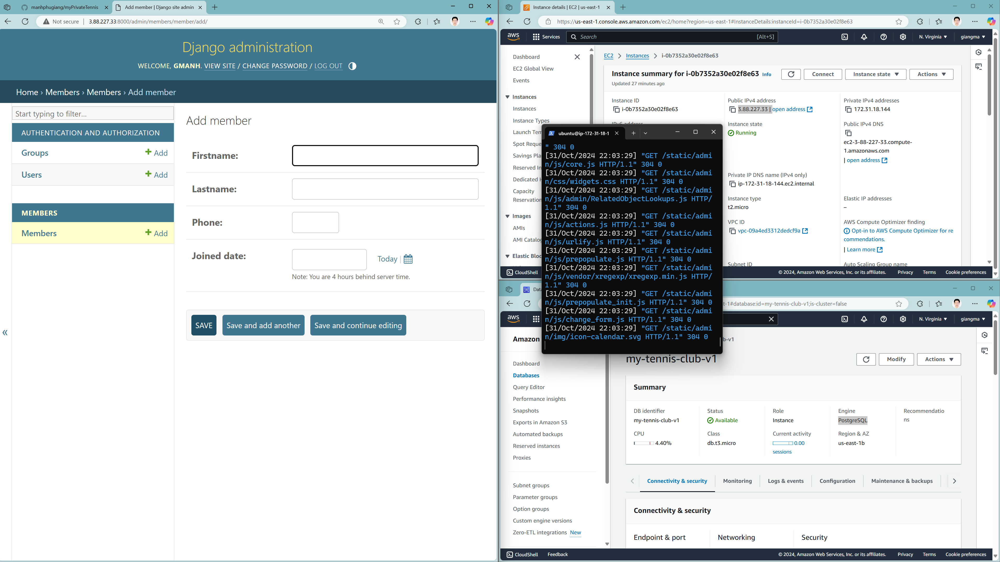

This is a small project that showcases my skill in Python - Django framework as a back-end, along with configuration skills with EC2 instance and RDS PostgreSQL all hosted on AWS.

[Watch my video](https://youtu.be/KmABQPCtEow)

This site will have two main parts: the Member List and Member Details, along with an Admin site to interact with the RDS database.

This is the Home Page with the URL to get the user to the Member List.

This is where the user can see the list of all Tennis Club Members.

This is the Details Page where each member will have 4 properties: Firstname, Lastname, Phone Number, and Joined Date.

This is the Admin Page where the admin can log in using the credential created via CLI "python manage.py createsuperuser".

Lastly is the page where the Admin can interact with the Database - this is Add member - but the admin can also Update and Delete. 

